# TIL 
# 2024-02-08

#### 오늘 한 일
1. SSAFY : 알고리즘 수업 진행, 실습과제 3개 및 중간 과제 진행, 모두 해결
2. 깃허브 TIL 작성
3. 프로그래머스 문제 풀기

#### 오늘 느낀 점
깊이우선탐색(DFS), 너비우선탐색(BFS)는 매우 코드가 어려웠다. 문제 유형들을 분석하고 해당 알고리즘에 익숙해질 필요가 있다.

#### 내일 할 일

# 학습내용

### DP (Dynamic Programming)
#### 동적 계획 알고리즘은 그리디 알고리즘과 같이 최적화 문제를 해결하는 알고리즘이다.

#### 동적 계획 알고리즘은 먼저 입력 크기가 작은 부분 문제들을 모두 해결한 후에 그 해들을 이용하여 보다 큰 크기의 부분 문제들을 해결하여, 최종적으로 원래 주어진 입력의 문제를 해결하는 알고리즘이다.

#### 피보나치 수 DP 적용
- 피보나치 수는 부분 문제의 답으로부터 본 문제의 답을 얻을 수 있으므로 최적 부분 구조로 이루어져 있다.
1) 문제를 부분 문제로 분할한다.
- Fibonacci(n) 함수는 Fibonacci(n-1)과 Fibonacci(n-2)의 합
- Fibonacci(n-1) 함수는 Fibonacci(n-2)과 Fibonacci(n-3)의 합
- Fibonacci(2) 함수는 Fibonacci(1)과 Fibonacci(0)의 합
- Fibonacci(n) 함수는 Fibonacci(n-1)과 Fibonacci(n-2).,,.. Fibonacci(2), Fibonacci(1),Fibonacci(0)의 부분집합으로 나뉜다.
2) 부분 문제로 나누는 일을 끝냈으면 가장 작은 부분 문제부터 해를 구한다.

3) 그 결과는 테이블에 저장하고, 테이블에 저장된 부분 문제의 해를 이용하여 상위 문제의 해를 구한다.
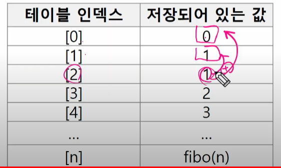
   
ㅇ
#### 피보나치 수 DP 적용 알고리즘
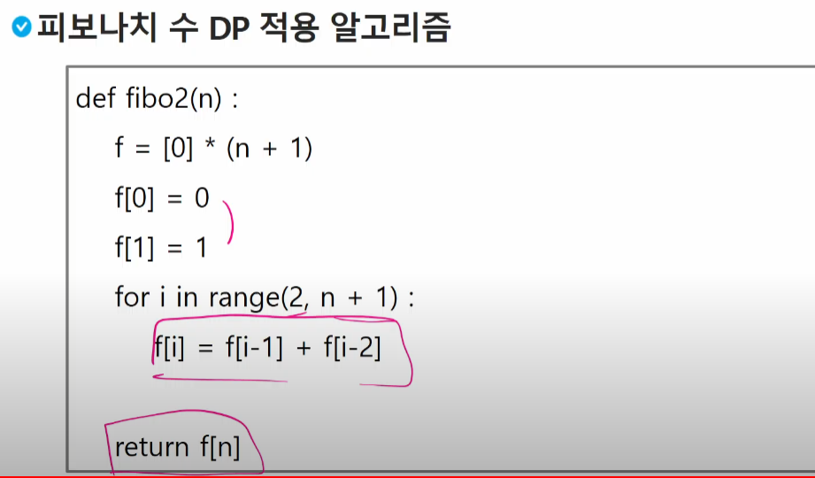

```
def fibo2(n):
    f = [0] * (n+1)
    f[0] = 0
    f[1] = 1
    for i in range(2, n + 1):
        f[i] = f[i-1] + f[i-2]
        
    return f[n]
```

#### DP의 구현 방식
- recursive 방식 : fib1()
- iterative 방식 : fib2()

- memoization을 재귀적 구조에 사용하는 것보다 반복적 구조로 DP를 구현한 것이 성능 면에서 보다 효율적이다.
- 재귀적 구조는 내부에 시스템 호출 스택을 사용하는 오버헤드가 발생하기 때문이다.

### DFS(깊이우선탐색)
#### 비선형구조인 그래프 구조는 그래프로 표현된 모든 자료를 빠짐없이 검색하는 것이 중요함.
#### 두 가지 방법
- 깊이 우선 탐색(Depth First Search, DFS)
- 너비 우선 탐색(Breadth First Search, BFS)

#### 시작 정점의 한 방향으로 갈 수 있는 경로가 있는 곳까지 깊이 탐색해 가다가 더 이상 갈 곳이 없게 되면, 가장 마지막에 만났던 갈림길 간선이 있는 정점으로 되돌아와서 다른 방향의 정점으로 탐색을 계속 반복하여 결국 모든 정점을 방문하는 순회방법
#### 가장 마지막에 만났던 갈림길의 정점으로 되돌아가서 다시 깊이 우선 탐색을 반복해야 하므로 후입선출 구조의 스택 사용

1) 시작 정점 v를 결정하여 방문한다.
2) 정점 v에 인접한 정점 중에서
    1. 방문하지 않은 정점 w가 있으면, 정점 v를 스택에 push하고 정점 w를 방문한다.
    그리고 w를 v로 하여 다시 2)를 반복한다.
    2. 방문하지 않은 정점이 없으면, 탐색의 방향을 바꾸기 위해서 스택을 pop하여 받은   
    가장 마지막 방문 정점을 v로 하여 다시 2)를 반복한다.
3) 스택이 공백이 될 때까지 2)를 반복한다.

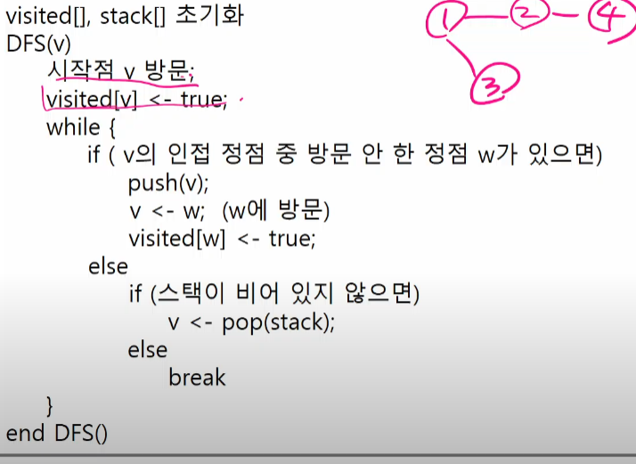

#### 초기 상태 : 배열 visited를 False로 초기화하고, 공백 스택을 생성
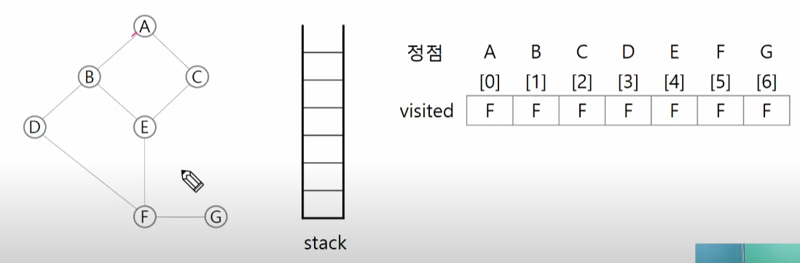

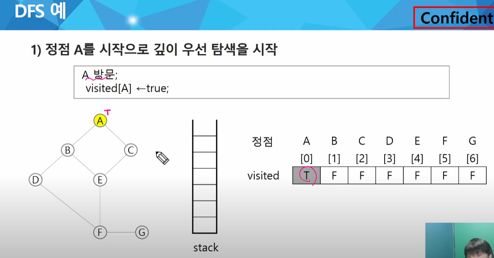

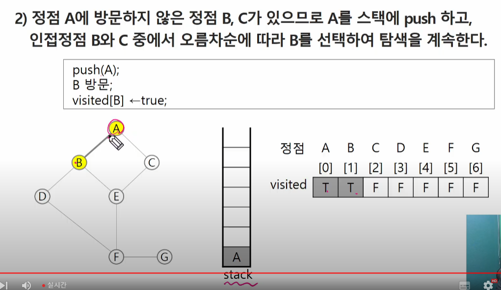

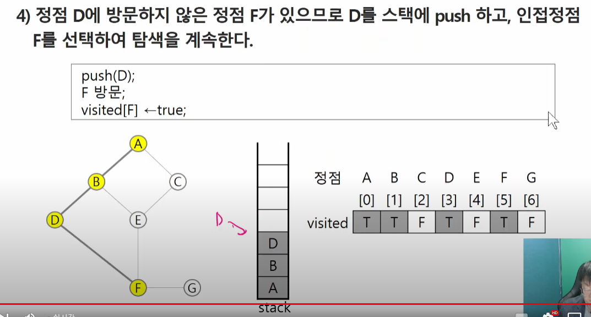

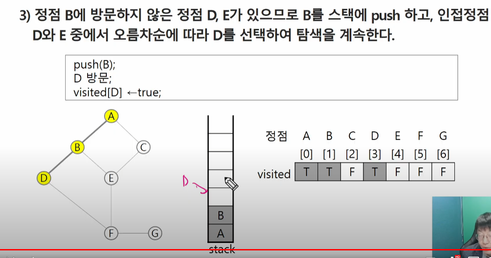

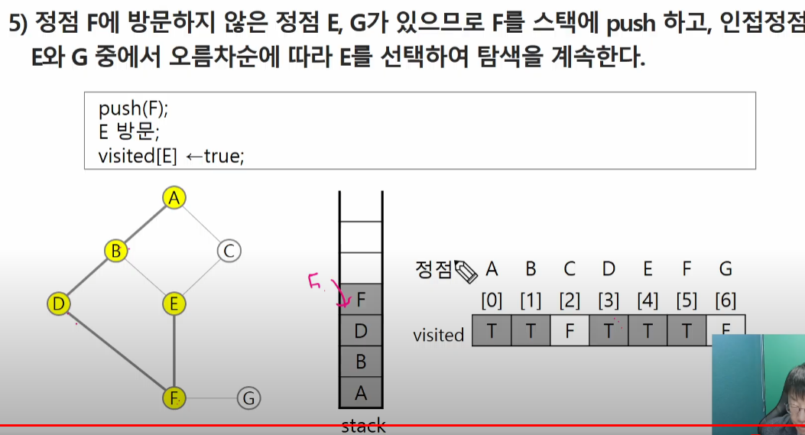

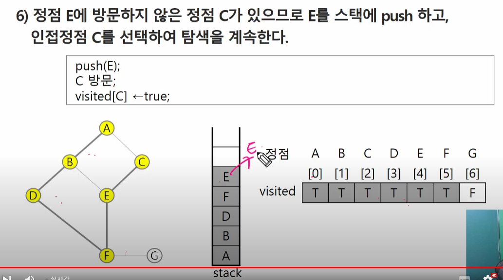

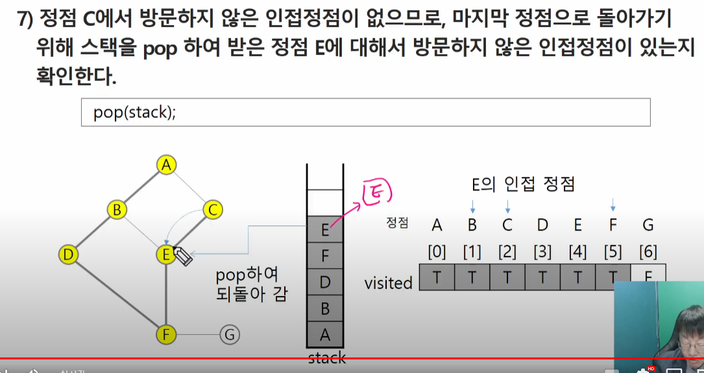

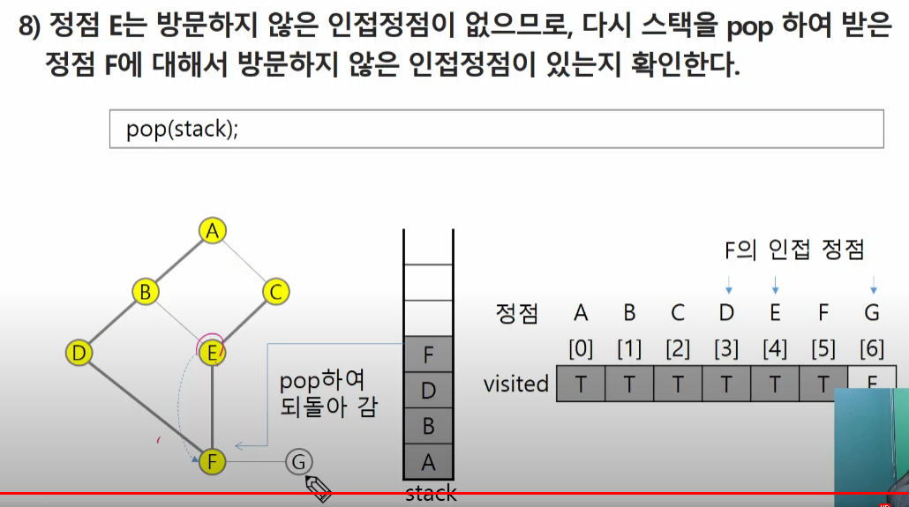

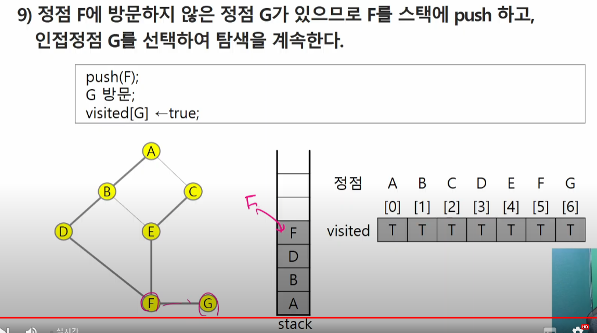

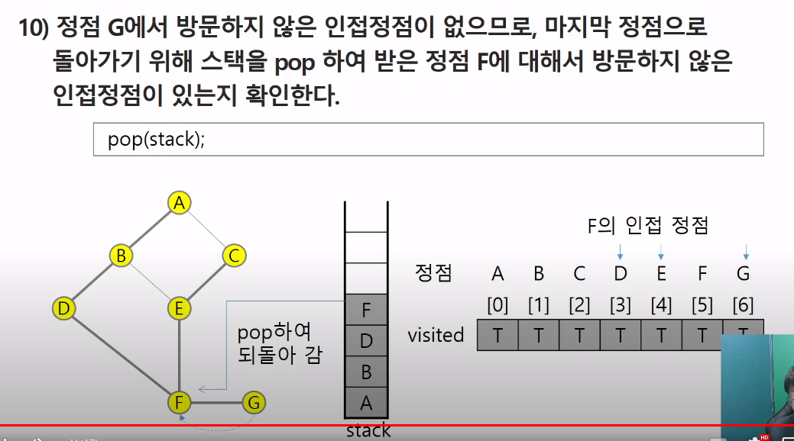

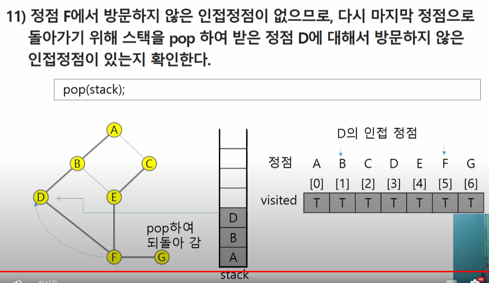

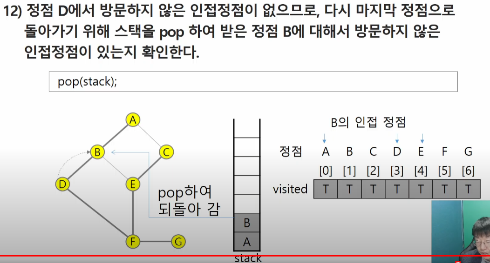

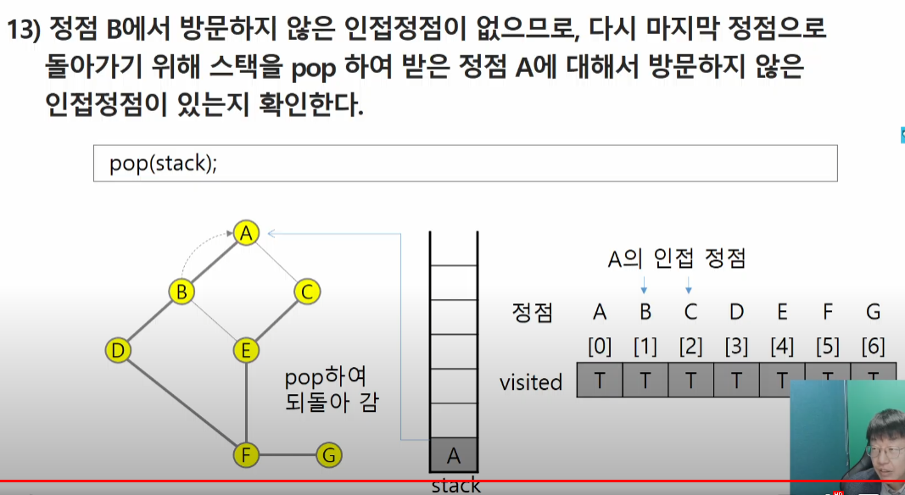

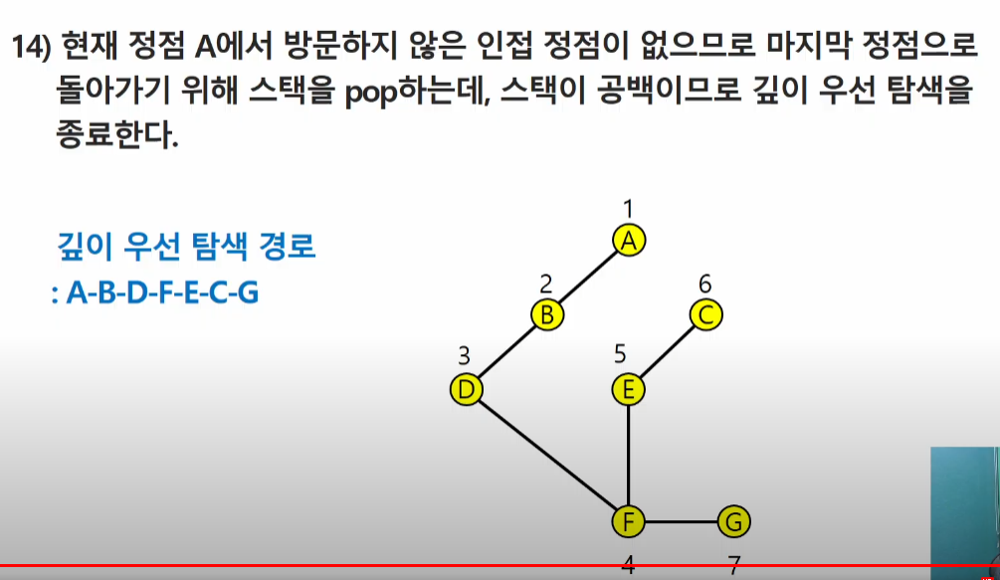

#### 연습문제3
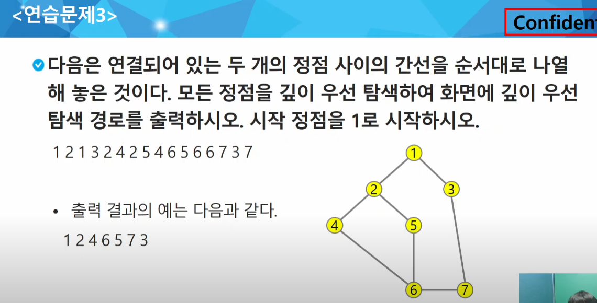


