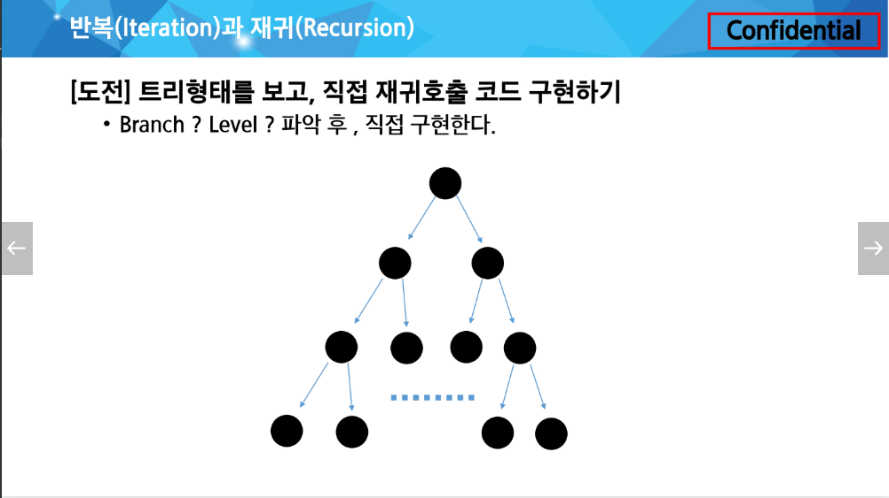
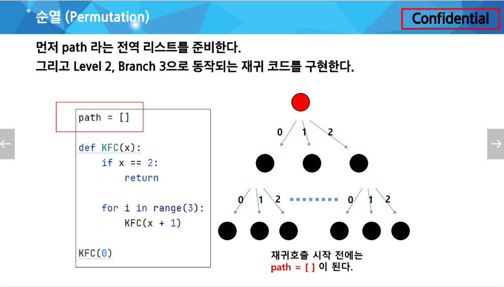

# TIL
# 2024-02-27

#### 오늘 한 일
1. SSAFY : 알고리즘 수업 진행, 실습과제 3개 및 중간 과제 진행, 모두 해결
2. 깃허브 TIL 작성
3. 프로그래머스 문제 풀기

#### 오늘 느낀 점

#### 내일 할 일

# 학습내용
### 반복과 재귀(Iteration and Recursion)
#### 재귀 호출 공부의 시작은, 무한 재귀호출을 막는 것부터 시작한다.
- 출력결과는 0110이다
- 아래 if문을 "기저조건 (base case)"이라고 한다.

#### [도전] 0 1 2 3 4 5 5 4 3 2 1 0을 재귀호출을 이용하여 구현한다.
(제한시간 : 3분)

