# TIL 
# 2024-02-15

#### 오늘 한 일
1. SSAFY : 알고리즘 수업 진행, 실습과제 3개 및 중간 과제 진행, 모두 해결
2. 깃허브 TIL 작성
3. 프로그래머스 문제 풀기

#### 오늘 느낀 점


#### 내일 할 일

# 학습내용

### 큐
#### 큐(Queue)의 특성
- 스택과 마찬가지로 삽입과 삭제의 위치가 제한적인 자료구조
    - 큐의 뒤에서는 삽입만 하고, 큐의 앞에서는 삭제만 이루어지는 구조
    
- 선입선출구조(FIFO : First In First Out)
    - 큐에 삽입한 순서대로 원소가 저장되어, 가장 먼저 삽입(First In)된 원소는 가장 먼저 삭제(First Out) 된다.
    
### 큐의 구조 및 기본연산
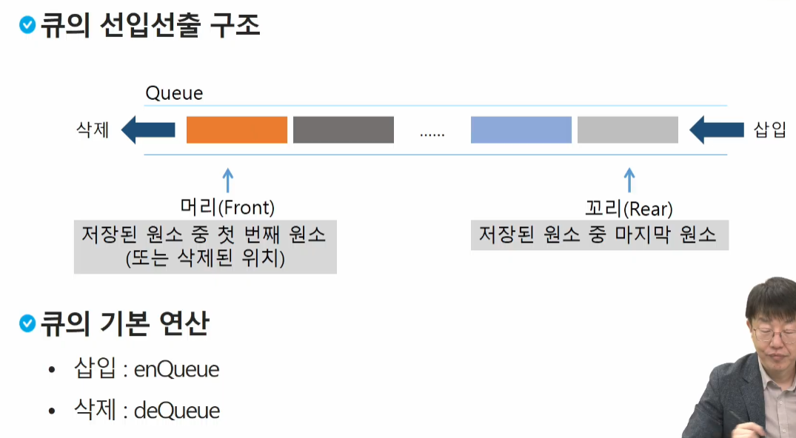
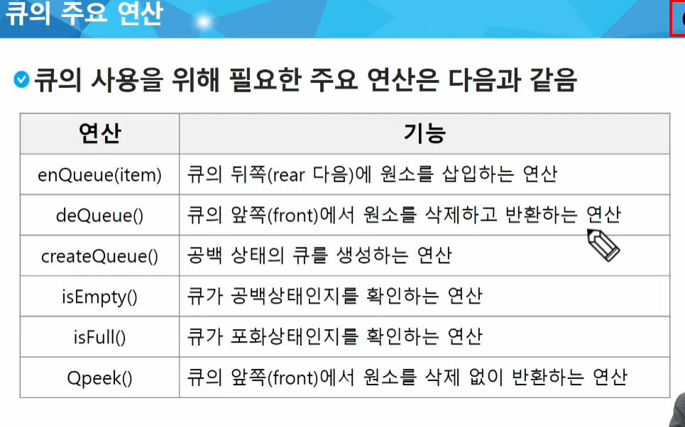
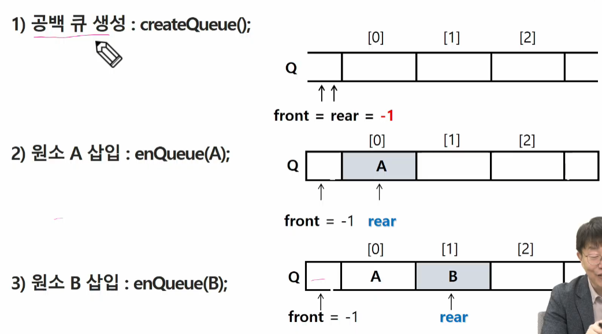
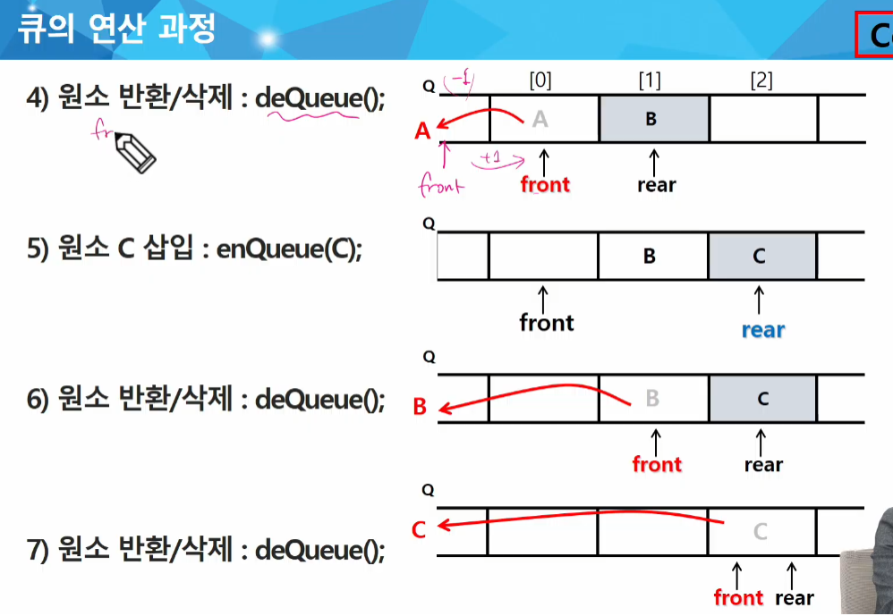

#### 선형큐
- 1차원 배열을 이용한 큐
    - 큐의 크기 = 배열의 크기
    - front : 마지막으로 삭제된 인덱스
    - rear : 저장된 마지막 원소의 인덱스

- 상태표현
    - 초기 상태 : front = rear = -1
    - 공백 상태 : front == rear
    - 포화 상태 : rear == n-1 (n : 배열의 크기, n-1 : 배열의 마지막 인덱스)
    
#### 초기 공백 큐 생성
- 크기 n인 1차원 배열 생성
- front와 rear를 -1로 초기화

#### 삽입 : enQueue(item)
- 마지막 원소 뒤에 새로운 원소를 삽입하기 위해
1) rear 값을 하나 증가시켜 새로운 원소를 삽입할 자리를 마련
2) 그 인덱스에 해당하는 배열원소 Q[rear]에 item을 저장
```buildoutcfg
def enQueue(item):
    global rear
    if isFull() : print("Queue_Full")
    else:
        rear <- rear + 1;
        Q[rear] <- item;
```
#### 삭제 : deQueue()
- 가장 앞에 있는 원소를 삭제하기 위해
1) front 값을 하나 증가시켜 큐에 남아있는 첫 번째 원소 이동
2) 새로운 첫 번째 원소를 리턴함으로써 삭제와 동일한 기능함

#### 공백상태 및 포화상태 검사 : isEmpty(), isFull()
- 공백상태 : front == rear
- 포화상태 : rear == n-1 (n : 배열의 크기, n-1 : 배열의 마지막 인덱스)

```
def isEmpty() : 
    return front == rear

def isFull():
    return rear == len(Q) - 1
```

#### 검색 : Qpeek()
- 가장 앞에 있는 원소를 검색하여 반환하는 연산
- 현재 front의 한자리 뒤(front+1)에 있는 원소, 즉 큐의 첫 번째에 있는 원소를 반환
```buildoutcfg
def Qpeek():
    if isEmpty() : print("Queue_Empty")
    else : return Q[front+1]
```

### 연습 문제 1
#### 큐를 구현하여 다음 동작을 확인해 봅시다
- 세 개의 데이터 1,2,3을 차례로 큐에 삽입하고
- 큐에서 세 개의 데이터를 차례로 꺼내서 출력한다.   
1,2,3이 출력되야 함
  
### 선형 큐 이용시의 문제점
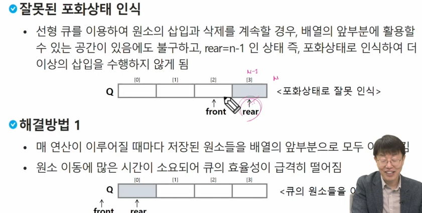
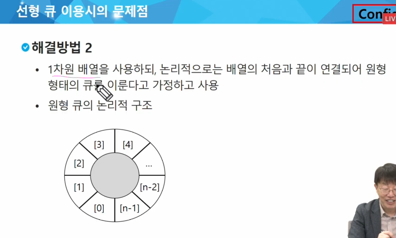

### 원형 큐의 구조
#### 초기 공백 상태
- front = rear = 0

#### Index의 순환
- front와 rear의 위치가 배열의 마지막 인덱스인 n-1를 가리킨 후, 그 다음에는 논리적 순환을 이루어 배열의 처음 인덱스인 0으로 이동해야 함.
- 이를 위해 나머지 연산자 mod를 사용함

#### front 변수
- 공백 상태와 포화 상태 구분을 쉽게 하기 위해 front가 있는 자리는 사용하지 않고 항상 빈 자리로 둠

#### 삽입 위치 및 삭제 위치
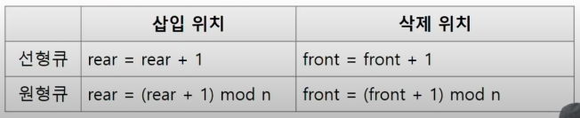

### 원형 큐의 연산 과정
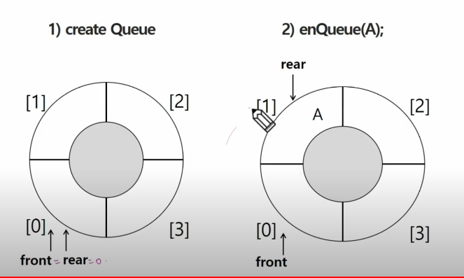
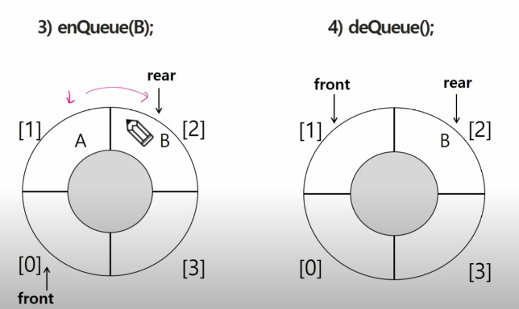


#### 공백 상태 및 포화상태 검사 : isEmpty(), isFull()
- 공백상태 : front == rear
- 포화상태 : 삽입할 rear의 다음 위치 == 현재 front
    - (rear + 1) mod n == front
    
```buildoutcfg
def isEmpty():
    return front == rear
    
def isFull():
    return (rear+1) % len(cQ) == front
```

#### 삽입 : enQueue(item)
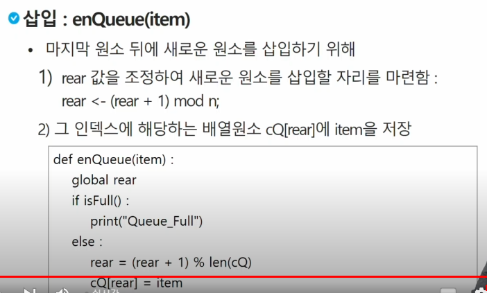
#### 삭제 : deQueue(), delete()
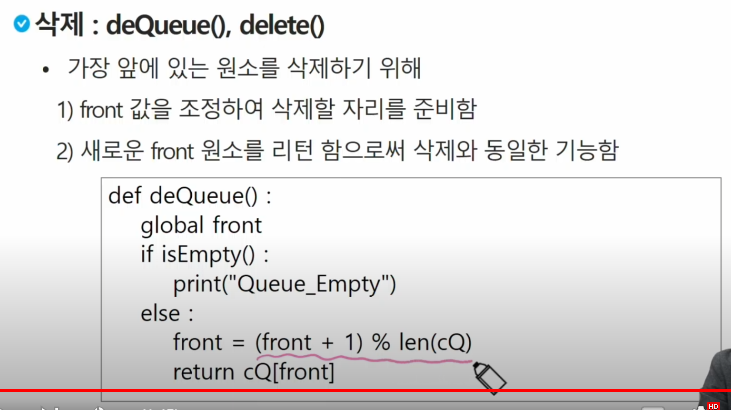

### 연결 큐의 구조
#### 단순 연결 리스트(Linked List)를 이용한 큐
- 큐의 원소 : 단순 연결 리스트의 노드
- 큐의 원소 순서 : 노드의 연결 순서. 링크로 연결되어 있음
- front : 첫 번째 노드를 가리키는 링크
- rear : 마지막 노드를 가리키는 링크

#### 상태 표현
- 초기 상태 : front = rear = null
- 공백 상태 : front = rear = null
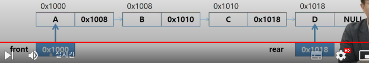
  
#### 연결 큐의 연산 과정
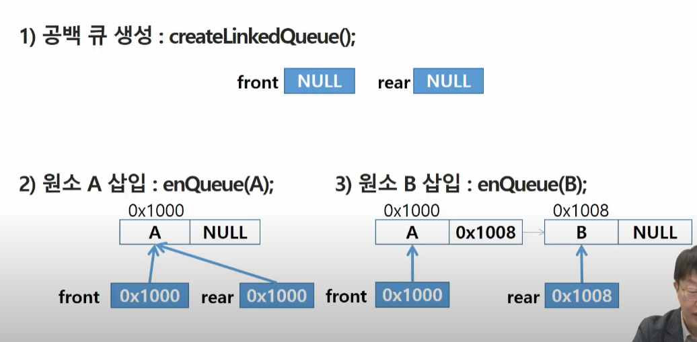
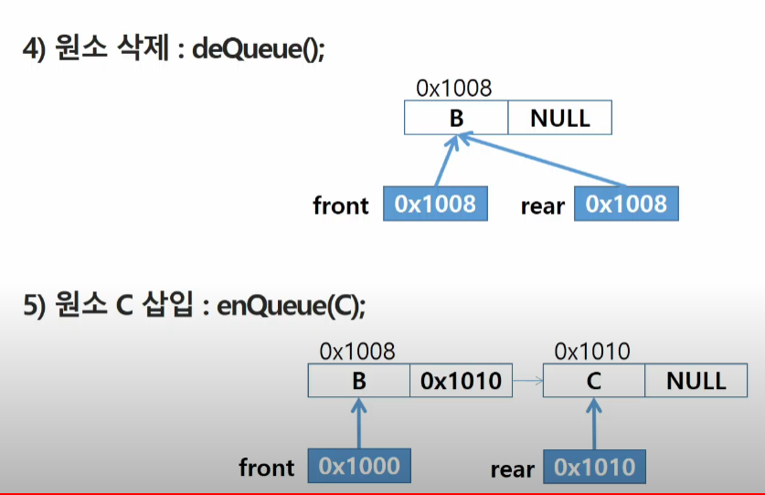
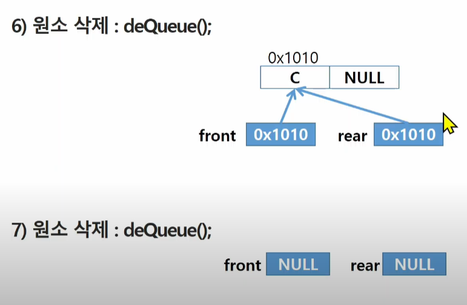

#### [참고] deque(덱)
#### 컨테이너 자료형 중 하나
#### deque 객체
- 양쪽 끝에서 빠르게 추가와 삭제를 할 수 있는 리스트류 컨테이너
#### 연산
- append(x) : 오른쪽에 x 추가
- popleft() : 왼쪽에서 요소를 제거하고 반환. 요소가 없으면 IndexError
```buildoutcfg
from collections import deque

q = deque()
q.append(1) # enqueue()
t = q.popleft() # dequeue()
```

### 우선순위 큐(Priority Queue)
#### 우선순위 큐의 특성
- 우선순위를 가진 항목들을 저장하는 큐
- FIFO 순서가 아니라 우선순위가 높은 순서대로 먼저 나가게 된다.

#### 우선순위 큐의 적용 분야
- 시뮬레이션 시스템
- 네트워크 트래픽 제어
- 운영체제의 테스크 스케줄링

#### 우선순위 큐의 구현
- 배열을 이용한 우선순위 큐
- 리스트를 이용한 우선순위 큐

#### 우선순위 큐의 기본 연산
- 삽입 : enQueue
- 삭제 : deQueue

  
### 배열을 이용하여 우선순위 큐 구현
#### 배열을 이용하여 우선순위 큐 구현
- 배열을 이용하여 자료 저장
- 원소를 삽입하는 과정에서 우선순위를 비교하여 적절한 위치에 삽입하는 구조
- 가장 앞에 최고 우선순위의 원소가 위치하게 됨

#### 문제점
- 배열을 사용하므로 삽입이나 삭제 연산이 일어날 때 원소 재배치가 발생함
- 이에 따른 소요 시간이나 메모리 낭비가 큼

### 큐의 활용 : 버퍼(Buffer)
####버퍼
- 데이터를 한 곳에서 다른 한 곳으로 전송하는 동안 일시적으로 그 데이터를 보관하는 메모리의 영역
- 버퍼링 : 버퍼를 활용하는 방식 또는 버퍼를 채우는 동작을 의미한다.

#### 버퍼의 자료 구조
- 버퍼는 일반적으로 입출력 및 네트워크와 관련된 기능에서 이용된다.
- 순서대로 입력 / 출력 / 전달 되어야 하므로 FIFO 방식의 자료구조는 큐가  활용된다.

### 키보드 버퍼
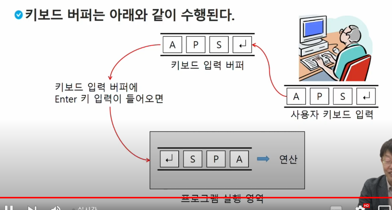

### 마이쮸
#### Queue를 이용하여 마이쮸 나눠주기 시뮬레이션을 해보자
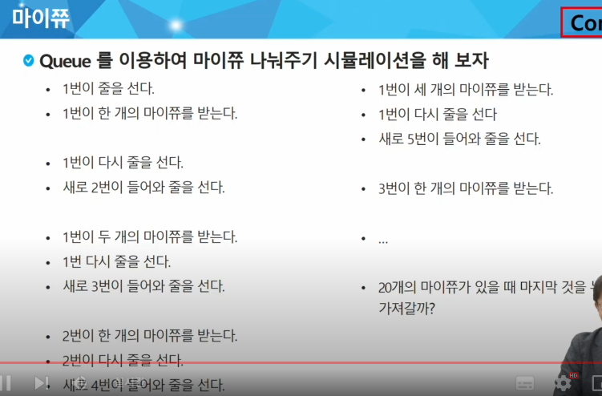
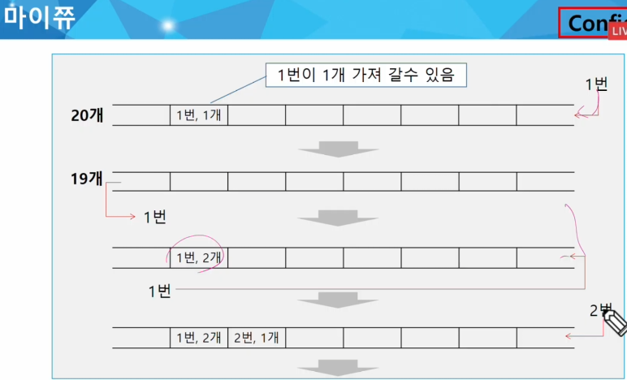
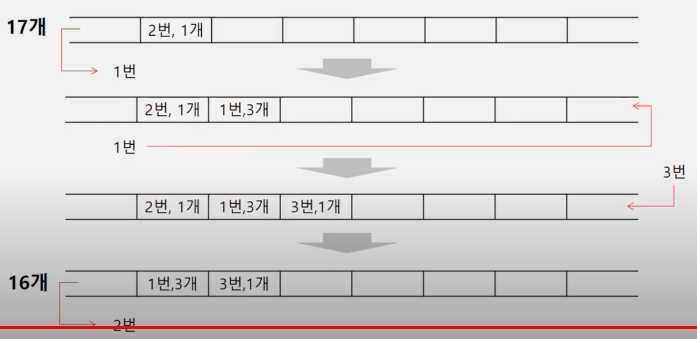


### 연습문제2
#### 마이쮸 시뮬레이션 구현

#### 엔터를 칠 때마다 다음 정보를 화면에 출력해보자.
- 큐에 있는 사람 수
- 현재 일인당 나눠주는 사탕의 수
= 현재까지 나눠준 사탕의 수