# TIL 
# 2024-02-16

#### 오늘 한 일
1. SSAFY : 알고리즘 수업 진행, 실습과제 3개 및 중간 과제 진행, 모두 해결
2. 깃허브 TIL 작성
3. 프로그래머스 문제 풀기

#### 오늘 느낀 점

#### 내일 할 일

# 학습내용

###BFS (Breadth First Search)

#### 그래프를 탐색하는 방법에는 크게 두 가지가 있음
- 깊이 우선 탐색(Depth First Search, DFS)
- 너비 우선 탐색(Breadth First Search, BFS)

#### 너비우선탐색은 탐색 시작점의 인접한 정점들을 먼저 모두 차례로 방문한 후에, 방문했던 정점을 시작점으로 하여 다시 인접한 정점들을 차례로 방문하는 방식

#### 인접한 정점들에 대해 탐색을 한 후, 차례로 다시 너비우선탐색을 진행해야 하므로, 선입선출 형태의 자료구조인 큐를 활용함.

#### BFS는 예제 그래프를 아래와 같은 순서로 탐색함
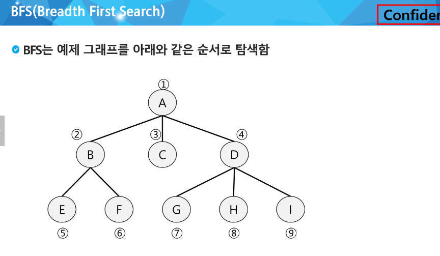

### BFS 알고리즘
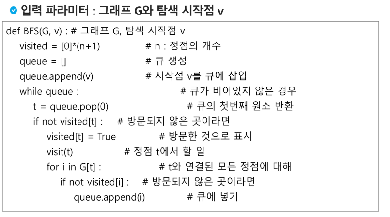

### BFS 예제
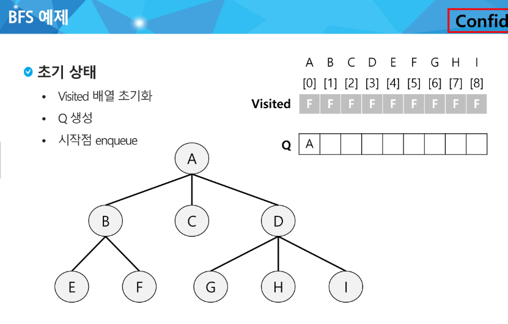
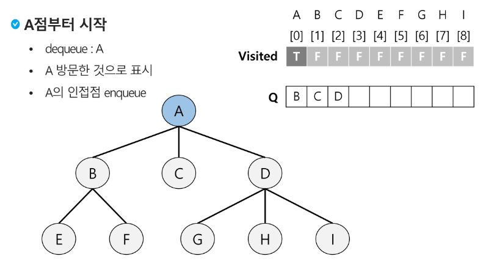
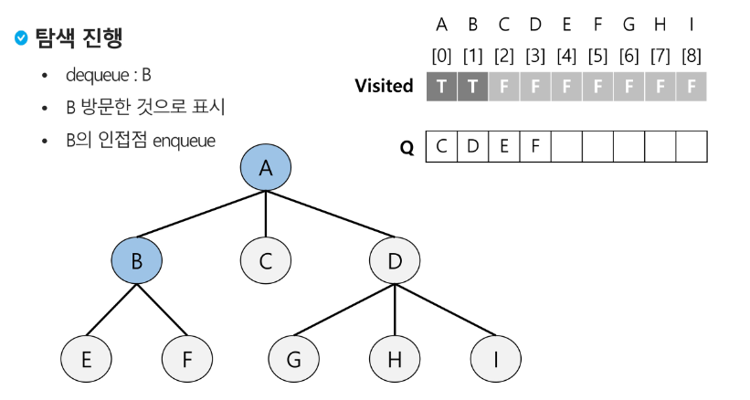
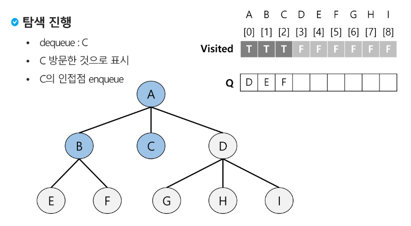
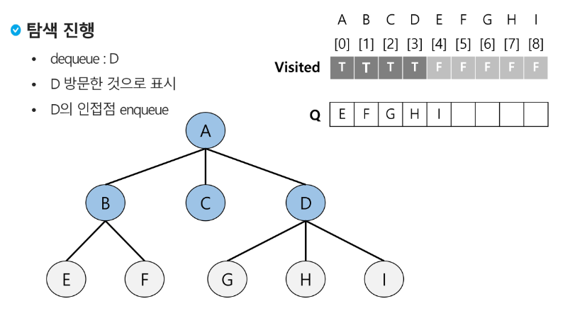
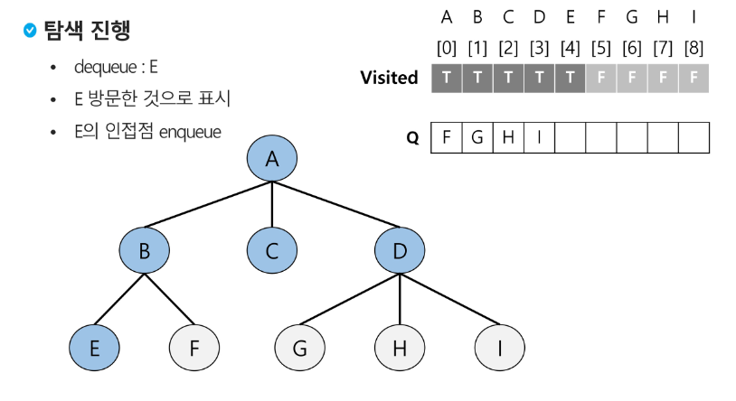
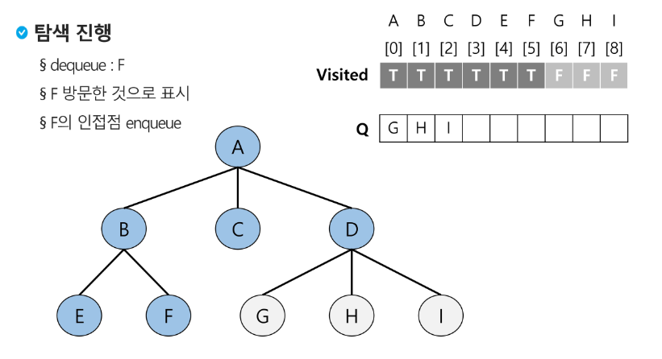
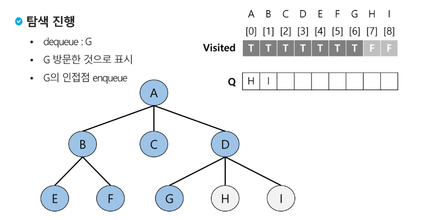
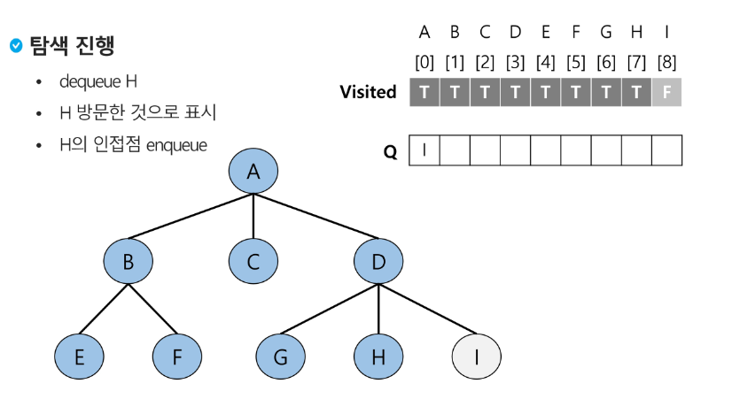
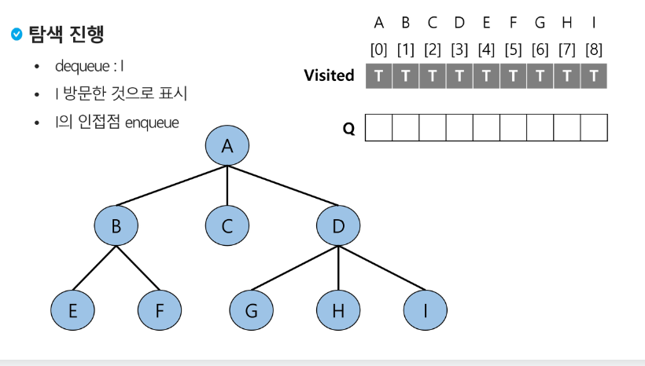
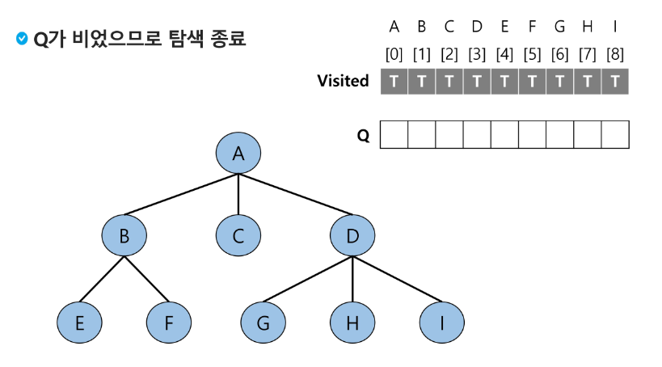

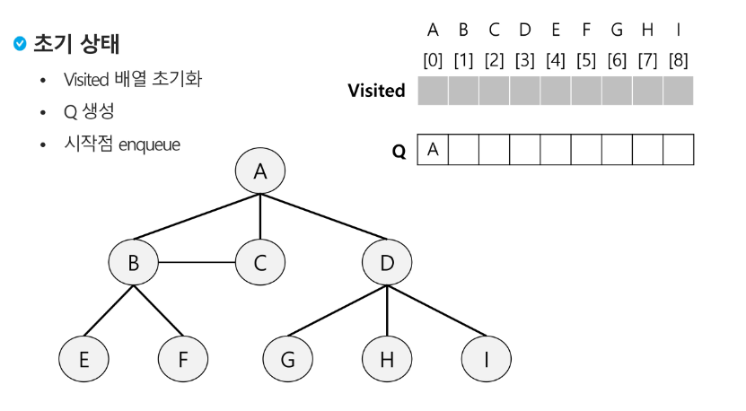

### 연습문제3
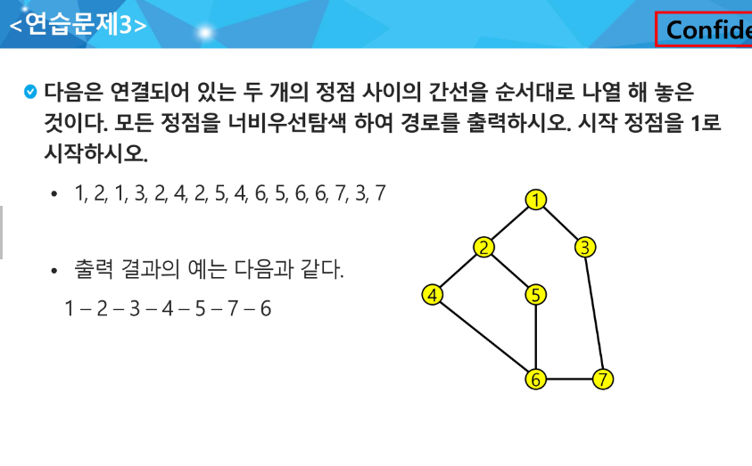