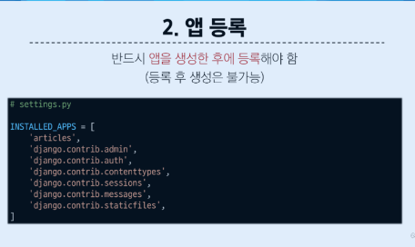
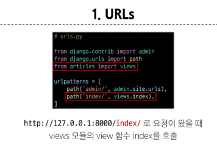
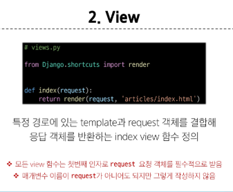
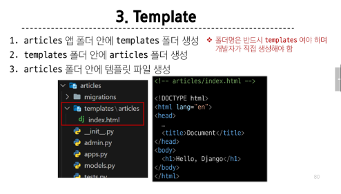
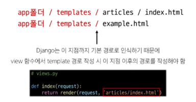
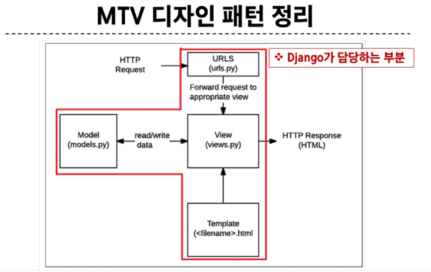

```
1. 가상 환경 venv 생성
python -m venv venv

2. 가상 환경 활성화
source venv/Scripts/activate

3. 환경에 설치된 패키지 목록 확인
pop list

4. 의존성 패키지 목록 생성
pip freeze > requirements.txt
```

#### Django 프로젝트 생성 전 루틴
```
1. 가상환경 생성
2. 가상환경 활성화
3. 3Django 설치
4. 의존성 파일 생성(패키지 설치시마다 진행)
5. .gitignore 파일 생성 (첫 add 전)
6. git 저장소 생성(원격 저장소에 올릴 경우)
7. Django 프로젝트 생성
```
#### Django 프로젝트 생성
django-admin startproject firstpjt . (firstpjt라는 이름의 프로젝트를 생성)

#### Django 서버 실행
python manage.py runserver (manage.py와 동일한 경로에서 진행)

#### 서버 확인
http://127.0.0.1:8000/ 접속 후 확인

#### MTV 디자인 패턴 (Model, Template, View)
View -> Template
Controller -> View

#### 앱을 사용하기 위한 순서
```
1. 앱 생성 (앱의 이름은 '복수형'으로 지정하는 것을 권장)
python manage.py startapp articles
2. 앱 등록 (반드시 앱을 생성 한 후에 등록해야 함.)

- settings.py : 프로젝트의 모든 설정을 관리
- urls.py : 요청 들어오는 URL에 따라 이에 해당하는 적절한 view 연결
- __init__.py : 해당 폴더를 패키지로 인식하도록 설정하는 파일
- asgi.py : 비동기식 웹 서버와의 연결 관련 설정
- wsgi.py : 웹 서버와의 연결 관련 설정
- manage.py : Django 프로젝트와 다양한 방법으로 상호작용 하는 커맨드라인 유틸리티
```

#### 앱 구조
- admin.py : 관리자용 페이지 설정
- models.py : DB와 관련된 Model을 정의, MTV 패턴의 M
- views.py : HTTP 요청을 처리하고 해당 요청에 대한 응답을 반환(url, model, template과 연계) MTV패턴의 V
- apps.py : 앱의 정보가 작성된 곳
- test.pt : 프로젝트 테스트 코드를 작성하는 곳

#### Django의 요청과 응답
1. URLs


2. View


3. Template


#### Django에서 template을 인식하는 경로 규칙
app폴더 / templates / articles / index.html
app폴더 / templates / example.html


#### 요청 후 응답 페이지 확인
http://127.0.0.1:8000/articles/

#### 데이터 흐름에 따른 코드 작성하기
URLs -> View -> Template

#### 데이터 흐름에 따른 코드 작성하기
```
URLs : path('articles/', views.index),
View : def index(request):
           return render(request, 'articles/index.html')
Template : articles/templates/articles/index.html
```

#### MTV 디자인 패턴 정리
- View
    - Model & Template과 관련한 로직을 처리해서 응답을 반환
    - 클라이언트의 요청에 대해 처리를 분기하는 역할
- Veiw 예시
    - 데이터가 필요하다면 model에 접근해서 데이터를 가져오고,
    - 가져온 데이터를 template로 보내 화면을 구성하고,
    - 구성된 화면을 응답으로 만들어 클라이언트에게 반환


#### render 함수
- 주어진 템플릿을 주어진 컨텍스트 데이터와 결합하고 렌더링된 텍스트와 함께 HttpResponse 응답 객체를 반환하는 함수
1. request
- 응답을 생성하는 데 사용되는 요청 객체
2. template_name
- 템플릿 이름의 경로
3. context
- 템플릿에서 사용할 데이터 (딕셔너리 타입으로 작성)
ex) render(request, template_name, context)

#### 참고 : 지금까지 나온 Django의 규칙
1. urls.py에서 각 url 경로는 반드시 '/'로 끝남
2. views.py에서 모든 view함수는 첫번째 인자로 요청 객체를 받음
- 매개변수 이름은 반드시 request로 지정
3. Django는 정해진 경로에 있는 template 파일만 읽어올 수 있음
- app폴더/templates/이후

